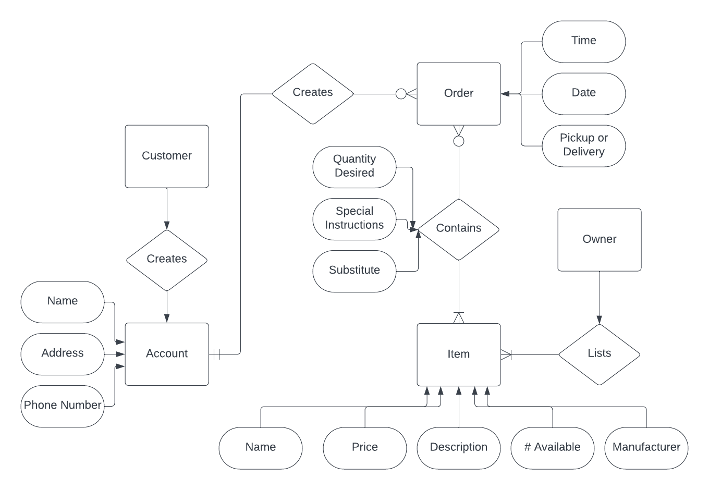
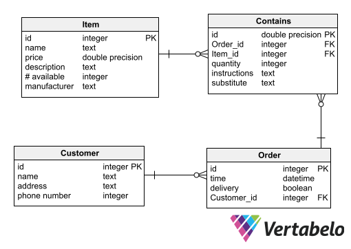

"Your local grocery store would like your help in creating an online grocery shopping web application. The owner of the store will be able to list items for sale, where the items have a name, price, description, quantity available, and a manufacturer. Customers will be able to go to the site and register to create an account, entering in their name, address, and phone number. Once registered, customers will be able to start an order for pickup or delivery. The customer can select from the food items the store has for sale. When an item is selected, the customer will note the quantity desired, any special instructions, and if this item can be substituted if the store is out of stock. Finally, when the customer finalizes their order, they will be able to choose a time and date for their order to be fulfilled. Finalized orders can no longer be changed by the customer."

First, I made the ERD. Making the ERD seems pretty intuitive to me. When first making the ERD, however, I had "Order" as a relationship instead of an entity. In my mind, I thought that it makes sense, the customer (entity) will order (relationship) items (entity). After working on the ERD a little bit more, I realized that the order was actually an entity itself that the customer can create. Cardinality is something that I am having a hard time wrapping my head around. I believe that I have the cardinality correct in the ERD, but I could easily be wrong. Understanding cardinality will come easier as I practice more, though.

After having the ERD all set up, making the database model was not an issue for me. By seeing how everything pieces together, it was not too much trouble turning it into tables. At first, the "Contains" table did not have a primary key, just the two foreign keys. After a little thinking, I thought it made sense for it to have its own ID. 

I feel satisfied with how this data is represented. The only thing that I could see being an issue is keeping up with the "Contains" part. It might be some trouble keeping up with the items vs the ordered items. As of now, I think this representation works, but I could see how complications would arise with the different kinds of items. The only assumptions that I can think of is how the data is represented in the tables. For example, I have the Order table with the delivery field that is represented by a boolean. If true, then it is delivery. If false, then it is for pickup. I suppose you could also just have it be text that says either "pick up" or "delivery". I like my implementation, though.
